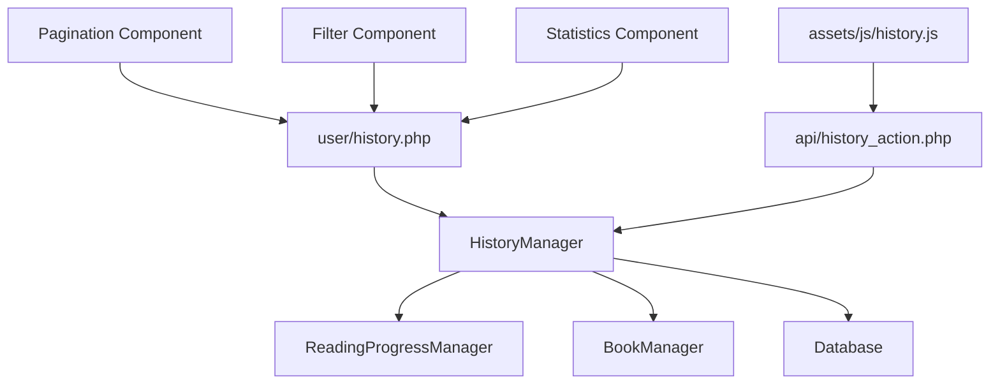

# Design Document: Reading History

## Overview

L'historique de lecture est une fonctionnalité qui s'intègre au système E-Lib existant pour fournir aux utilisateurs une vue complète de leur activité de lecture. Cette fonctionnalité exploite les données de progression existantes tout en ajoutant une couche de présentation et de gestion dédiée à l'historique personnel.

Le système maintient un équilibre entre la richesse des informations présentées et les performances, en utilisant des techniques de pagination et de lazy loading pour gérer efficacement les historiques volumineux.

## Architecture

### Composants principaux



### Intégration avec l'existant

La fonctionnalité s'appuie sur :
- **ReadingProgressManager** : Pour les données de progression existantes
- **BookManager** : Pour les métadonnées des livres
- **AuthManager** : Pour l'authentification et les sessions utilisateur
- **DatabaseManager** : Pour l'accès aux données

## Components and Interfaces

### HistoryManager Class

```php
class HistoryManager {
    private DatabaseManager $db;
    private ReadingProgressManager $progressManager;
    private BookManager $bookManager;
    
    // Core functionality
    public function getUserHistory(int $userId, array $options = []): array
    public function removeHistoryEntry(int $userId, int $bookId): bool
    public function clearUserHistory(int $userId): bool
    
    // Statistics and analytics
    public function getUserStatistics(int $userId): array
    public function getReadingPatterns(int $userId): array
    
    // Filtering and search
    public function filterHistory(int $userId, array $filters): array
    public function searchHistory(int $userId, string $query): array
}
```

### Interface utilisateur

#### Page principale (user/history.php)
- **Header** : Titre, statistiques rapides, boutons d'action
- **Filters Bar** : Recherche, filtres par statut, date range
- **History List** : Grille responsive des entrées d'historique
- **Pagination** : Navigation entre les pages
- **Statistics Panel** : Métriques de lecture (collapsible)

#### Composants réutilisables
- **HistoryCard** : Affichage d'une entrée d'historique
- **ProgressBar** : Barre de progression visuelle
- **FilterPanel** : Interface de filtrage
- **StatisticsWidget** : Affichage des statistiques

### API Endpoints

```php
// api/history_action.php
POST /api/history_action.php
{
    "action": "remove_entry|clear_all|get_statistics",
    "book_id": int (pour remove_entry),
    "user_id": int
}
```

## Data Models

### Structure de données existante exploitée

```sql
-- Table reading_progress (existante)
-- Utilisée comme source principale pour l'historique
SELECT rp.*, b.title, b.author, b.cover_image, b.file_path
FROM reading_progress rp
JOIN books b ON rp.book_id = b.id
WHERE rp.user_id = ? AND rp.last_read IS NOT NULL
ORDER BY rp.last_read DESC
```

### Nouvelles structures de données

```sql
-- Table history_settings (nouvelle)
CREATE TABLE history_settings (
    id INT PRIMARY KEY AUTO_INCREMENT,
    user_id INT NOT NULL,
    auto_cleanup_days INT DEFAULT 365,
    show_statistics BOOLEAN DEFAULT TRUE,
    items_per_page INT DEFAULT 20,
    created_at TIMESTAMP DEFAULT CURRENT_TIMESTAMP,
    updated_at TIMESTAMP DEFAULT CURRENT_TIMESTAMP ON UPDATE CURRENT_TIMESTAMP,
    FOREIGN KEY (user_id) REFERENCES users(id) ON DELETE CASCADE,
    UNIQUE KEY unique_user_settings (user_id)
);

-- Index pour optimiser les requêtes d'historique
CREATE INDEX idx_reading_progress_history 
ON reading_progress (user_id, last_read DESC);
```

### Modèle de données pour l'historique

```php
class HistoryEntry {
    public int $bookId;
    public string $title;
    public string $author;
    public string $coverImage;
    public float $progressPercentage;
    public DateTime $lastRead;
    public string $readingStatus; // 'not_started', 'in_progress', 'completed'
    public int $totalPages;
    public int $currentPage;
    public string $estimatedTimeRemaining;
}

class UserStatistics {
    public int $totalBooksRead;
    public int $booksThisMonth;
    public int $booksThisYear;
    public float $averageCompletionRate;
    public array $topCategories;
    public array $favoriteAuthors;
    public int $totalReadingTimeMinutes;
    public float $averageReadingSpeed; // pages per hour
}
```

## Correctness Properties

*A property is a characteristic or behavior that should hold true across all valid executions of a system-essentially, a formal statement about what the system should do. Properties serve as the bridge between human-readable specifications and machine-verifiable correctness guarantees.*

### Property Reflection

After reviewing all properties identified in the prework, I've identified several areas where properties can be consolidated:

- Properties 1.1 and 1.5 both deal with chronological ordering and can be combined
- Properties 3.1, 3.2, and 3.3 all deal with progress display and can be unified
- Properties 4.1, 4.2, and 4.3 all deal with filtering and can be combined into comprehensive filter testing
- Properties 5.1, 5.2, 5.3, and 5.4 all deal with statistics calculation and can be unified

### Core Properties

**Property 1: Chronological History Display**
*For any* user with reading history, the history page should display all books in chronological order by last read date (most recent first), with proper pagination of 20 items per page
**Validates: Requirements 1.1, 1.4, 1.5**

**Property 2: Complete History Entry Information**
*For any* history entry displayed, the rendered output should contain book cover, title, author, last read date, and reading progress information
**Validates: Requirements 1.2**

**Property 3: History Management Data Integrity**
*For any* history management operation (remove entry, clear all), the system should preserve reading progress data while only affecting history visibility
**Validates: Requirements 2.2, 2.4**

**Property 4: Progress Display Consistency**
*For any* book in the history, the progress display should show percentage, appropriate visual indicators (progress bar for partial, completion marker for 100%), and correct status classification
**Validates: Requirements 3.1, 3.2, 3.3**

**Property 5: History Navigation Accuracy**
*For any* history entry clicked, the system should open the book at the exact last read position stored in the reading progress
**Validates: Requirements 3.4**

**Property 6: Automatic History Updates**
*For any* reading progress change, the history display should reflect the updated information without manual refresh
**Validates: Requirements 3.5**

**Property 7: Comprehensive Filtering**
*For any* combination of filters (search query, reading status, date range), the results should include only entries that match ALL applied criteria
**Validates: Requirements 4.1, 4.2, 4.3, 4.4**

**Property 8: Statistics Accuracy**
*For any* user's reading data, the calculated statistics (books read, completion rates, reading patterns) should accurately reflect the underlying progress and history data
**Validates: Requirements 5.1, 5.2, 5.3, 5.4**

**Property 9: Real-time Statistics Updates**
*For any* new reading session or progress update, the statistics should update immediately to reflect the new data
**Validates: Requirements 5.5**

**Property 10: Accessibility Compliance**
*For any* interactive element in the history interface, appropriate ARIA labels, keyboard navigation support, and screen reader compatibility should be present
**Validates: Requirements 6.3, 6.4**

**Property 11: Performance Optimization**
*For any* history page load, the initial query should fetch only recent entries (configurable limit), with additional entries loaded on demand through lazy loading
**Validates: Requirements 7.1, 7.2**

**Property 12: Audit Logging**
*For any* history management action (remove, clear), an appropriate audit log entry should be created with user ID, action type, and timestamp
**Validates: Requirements 2.5**

## Error Handling

### Validation des données
- **Données manquantes** : Gestion gracieuse des livres sans progression
- **Données corrompues** : Validation des pourcentages de progression (0-100%)
- **Références invalides** : Vérification de l'existence des livres référencés

### Gestion des erreurs utilisateur
- **Historique vide** : Affichage d'un état vide avec suggestions d'action
- **Filtres sans résultats** : Message informatif avec options de modification
- **Actions non autorisées** : Vérification des permissions avant exécution

### Erreurs système
- **Problèmes de base de données** : Fallback vers cache local si disponible
- **Timeouts** : Pagination plus agressive pour réduire la charge
- **Erreurs de calcul** : Valeurs par défaut sécurisées pour les statistiques

## Testing Strategy

### Dual Testing Approach
L'implémentation utilisera une approche de test double combinant :
- **Tests unitaires** : Pour les cas spécifiques, les cas limites et les conditions d'erreur
- **Tests basés sur les propriétés** : Pour vérifier les propriétés universelles sur tous les inputs

### Configuration des tests basés sur les propriétés
- **Framework** : PHPUnit avec Eris pour la génération de données
- **Itérations minimales** : 100 par test de propriété
- **Étiquetage** : Chaque test référence sa propriété de design
- **Format d'étiquette** : **Feature: reading-history, Property {number}: {property_text}**

### Tests unitaires spécifiques
- **États vides** : Test de l'affichage quand aucun historique n'existe
- **Cas limites** : Gestion des progressions à 0% et 100%
- **Intégration** : Tests des interactions entre composants
- **Performance** : Tests de charge pour les gros historiques

### Générateurs de données pour les tests
- **Générateur d'historique** : Crée des historiques de tailles variables avec des données cohérentes
- **Générateur de progression** : Produit des données de progression valides (0-100%)
- **Générateur de filtres** : Crée des combinaisons de filtres valides
- **Générateur de statistiques** : Produit des données de test pour les calculs de métriques

Les tests de propriétés valideront que les propriétés de correction universelles sont maintenues à travers tous les inputs générés, tandis que les tests unitaires se concentreront sur des exemples spécifiques et des cas d'erreur.