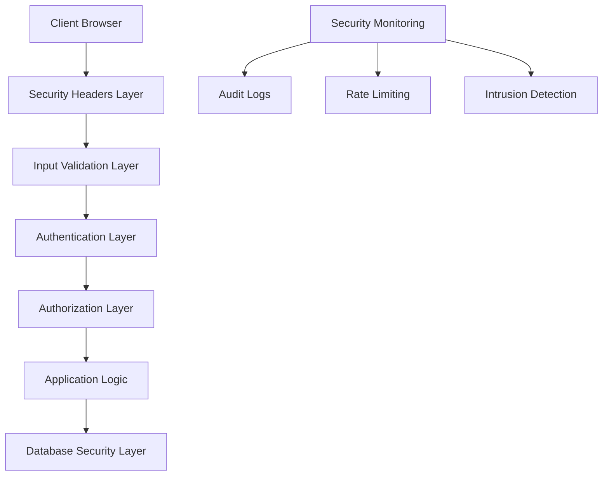

# Design Document - Amélioration de la Sécurité

## Overview

Ce document présente la conception technique pour renforcer la sécurité de l'application E-Lib Digital Library. La solution implémente une approche multicouche pour protéger contre les vulnérabilités web communes et améliorer la posture de sécurité globale du système.

## Architecture

### Couches de Sécurité



### Composants de Sécurité

1. **Security Headers Manager** - Gestion des en-têtes HTTP sécurisés
2. **Enhanced Input Validator** - Validation et sanitisation avancées
3. **Session Security Manager** - Gestion sécurisée des sessions
4. **CSRF Protection Manager** - Protection contre les attaques CSRF
5. **Rate Limiting Engine** - Limitation du taux de requêtes
6. **Security Audit Logger** - Journalisation des événements de sécurité
7. **Password Security Manager** - Gestion sécurisée des mots de passe

## Components and Interfaces

### 1. Enhanced Security Headers Manager

```php
class EnhancedSecurityHeaders {
    public static function setStrictHeaders(): void
    public static function setCSPHeaders(array $directives = []): void
    public static function setHSTSHeaders(): void
    public static function setDownloadHeaders(string $filename, string $mimeType): void
    public static function preventCaching(): void
}
```

**Responsabilités:**
- Configuration des en-têtes de sécurité HTTP
- Implémentation de Content Security Policy (CSP)
- Configuration HSTS pour HTTPS
- Protection contre le clickjacking et MIME sniffing

### 2. Advanced Input Validator

```php
class AdvancedInputValidator {
    public static function validateAndSanitize(array $data, array $rules): array
    public static function validateCSRFToken(string $token): bool
    public static function sanitizeFilename(string $filename): string
    public static function validateFileUpload(array $file, array $config): array
    public static function validateURL(string $url): bool
    public static function sanitizeHTML(string $input, array $allowedTags = []): string
}
```

**Responsabilités:**
- Validation complète des entrées utilisateur
- Sanitisation contre XSS et injection
- Validation des uploads de fichiers
- Protection contre directory traversal

### 3. Enhanced Session Security

```php
class EnhancedSessionSecurity {
    public static function initSecureSession(array $config = []): void
    public static function regenerateSessionId(): void
    public static function validateSessionIntegrity(): bool
    public static function setSessionFingerprint(): void
    public static function checkSessionTimeout(int $timeout): bool
    public static function destroySessionSecurely(): void
    public static function detectSessionHijacking(): bool
}
```

**Responsabilités:**
- Configuration sécurisée des sessions
- Détection de hijacking de session
- Gestion des timeouts
- Fingerprinting de session

### 4. CSRF Protection Manager

```php
class CSRFProtectionManager {
    public static function generateToken(): string
    public static function validateToken(string $token): bool
    public static function injectTokenInForms(string $html): string
    public static function getTokenForAjax(): string
    public static function rotateToken(): void
}
```

**Responsabilités:**
- Génération et validation des tokens CSRF
- Injection automatique dans les formulaires
- Support pour les requêtes AJAX
- Rotation périodique des tokens

### 5. Advanced Rate Limiter

```php
class AdvancedRateLimiter {
    public static function checkLimit(string $key, int $maxAttempts, int $timeWindow): bool
    public static function recordAttempt(string $key): void
    public static function resetAttempts(string $key): void
    public static function getTimeUntilReset(string $key): int
    public static function isBlocked(string $identifier): bool
    public static function blockTemporarily(string $identifier, int $duration): void
}
```

**Responsabilités:**
- Limitation des tentatives de connexion
- Blocage temporaire d'IP
- Gestion des fenêtres de temps
- Protection contre les attaques par force brute

### 6. Security Audit Logger

```php
class SecurityAuditLogger {
    public static function logSecurityEvent(string $event, array $context = []): void
    public static function logFailedLogin(string $identifier, string $ip): void
    public static function logSuspiciousActivity(string $activity, array $details): void
    public static function logPrivilegeEscalation(int $userId, string $action): void
    public static function logDataAccess(int $userId, string $resource): void
    public static function generateSecurityReport(string $period): array
}
```

**Responsabilités:**
- Journalisation des événements de sécurité
- Audit des accès aux données
- Détection d'activités suspectes
- Génération de rapports de sécurité

### 7. Password Security Manager

```php
class PasswordSecurityManager {
    public static function hashPassword(string $password): string
    public static function verifyPassword(string $password, string $hash): bool
    public static function validatePasswordStrength(string $password): array
    public static function generateSecurePassword(int $length = 12): string
    public static function checkPasswordHistory(int $userId, string $password): bool
    public static function enforcePasswordPolicy(string $password): array
}
```

**Responsabilités:**
- Hachage sécurisé des mots de passe
- Validation de la force des mots de passe
- Historique des mots de passe
- Génération de mots de passe sécurisés

## Data Models

### Security Event Log

```sql
CREATE TABLE security_events (
    id INT PRIMARY KEY AUTO_INCREMENT,
    event_type VARCHAR(50) NOT NULL,
    user_id INT NULL,
    ip_address VARCHAR(45) NOT NULL,
    user_agent TEXT,
    event_data JSON,
    severity ENUM('low', 'medium', 'high', 'critical') DEFAULT 'medium',
    created_at TIMESTAMP DEFAULT CURRENT_TIMESTAMP,
    INDEX idx_event_type (event_type),
    INDEX idx_user_id (user_id),
    INDEX idx_ip_address (ip_address),
    INDEX idx_created_at (created_at)
);
```

### Rate Limiting Storage

```sql
CREATE TABLE rate_limits (
    id INT PRIMARY KEY AUTO_INCREMENT,
    identifier VARCHAR(255) NOT NULL,
    attempt_count INT DEFAULT 0,
    first_attempt TIMESTAMP DEFAULT CURRENT_TIMESTAMP,
    last_attempt TIMESTAMP DEFAULT CURRENT_TIMESTAMP,
    blocked_until TIMESTAMP NULL,
    UNIQUE KEY unique_identifier (identifier),
    INDEX idx_blocked_until (blocked_until)
);
```

### Password History

```sql
CREATE TABLE password_history (
    id INT PRIMARY KEY AUTO_INCREMENT,
    user_id INT NOT NULL,
    password_hash VARCHAR(255) NOT NULL,
    created_at TIMESTAMP DEFAULT CURRENT_TIMESTAMP,
    FOREIGN KEY (user_id) REFERENCES users(id) ON DELETE CASCADE,
    INDEX idx_user_id (user_id),
    INDEX idx_created_at (created_at)
);
```

### Session Security

```sql
CREATE TABLE secure_sessions (
    session_id VARCHAR(128) PRIMARY KEY,
    user_id INT NOT NULL,
    ip_address VARCHAR(45) NOT NULL,
    user_agent_hash VARCHAR(64) NOT NULL,
    created_at TIMESTAMP DEFAULT CURRENT_TIMESTAMP,
    last_activity TIMESTAMP DEFAULT CURRENT_TIMESTAMP,
    is_valid BOOLEAN DEFAULT TRUE,
    FOREIGN KEY (user_id) REFERENCES users(id) ON DELETE CASCADE,
    INDEX idx_user_id (user_id),
    INDEX idx_last_activity (last_activity)
);
```

## Correctness Properties

*A property is a characteristic or behavior that should hold true across all valid executions of a system-essentially, a formal statement about what the system should do. Properties serve as the bridge between human-readable specifications and machine-verifiable correctness guarantees.*

### Property 1: CSRF Token Validation
*For any* form submission, if a CSRF token is provided, it must be valid and match the current session token before the request is processed.
**Validates: Requirements 1.1**

### Property 2: CSRF Token Rejection and Logging
*For any* request with an invalid or missing CSRF token, the system must reject the request and log the security event.
**Validates: Requirements 1.2**

### Property 3: CSRF Token Uniqueness
*For any* new user session, the system must generate a unique CSRF token that differs from all other active session tokens.
**Validates: Requirements 1.3**

### Property 4: HTML Entity Escaping
*For any* user input displayed in the application, all HTML entities must be properly escaped to prevent XSS execution.
**Validates: Requirements 2.1**

### Property 5: Input Sanitization
*For any* user input being stored, dangerous content must be sanitized while preserving legitimate data.
**Validates: Requirements 2.2**

### Property 6: Security Headers Presence
*For any* HTTP response, required security headers (X-Frame-Options, X-Content-Type-Options, CSP) must be present and properly configured.
**Validates: Requirements 2.3, 8.1, 8.2, 8.3**

### Property 7: Login Rate Limiting
*For any* sequence of failed login attempts from the same identifier, rate limiting must be enforced after the maximum threshold is reached.
**Validates: Requirements 3.1, 10.1**

### Property 8: Password Policy Enforcement
*For any* password creation or update, the password must meet all defined complexity requirements before being accepted.
**Validates: Requirements 3.2, 9.1**

### Property 9: Session Fingerprinting
*For any* new session creation, the system must implement session fingerprinting with user agent and IP tracking.
**Validates: Requirements 3.3, 5.1**

### Property 10: Database Input Validation
*For any* database operation with user-provided parameters, all inputs must be validated and sanitized before query execution.
**Validates: Requirements 4.2, 4.3**

### Property 11: Session ID Regeneration
*For any* successful login, the system must regenerate the session ID to prevent session fixation attacks.
**Validates: Requirements 5.2**

### Property 12: Session Invalidation on Suspicious Activity
*For any* detected suspicious activity, the associated session must be immediately invalidated and the event logged.
**Validates: Requirements 5.4**

### Property 13: Universal Input Validation
*For any* user-submitted data, all input fields must be validated according to their defined validation rules.
**Validates: Requirements 6.1**

### Property 14: File Upload Validation
*For any* file upload attempt, the file type, size, and content must be validated against security policies before acceptance.
**Validates: Requirements 6.3**

### Property 15: Filename Sanitization
*For any* uploaded file, the filename must be sanitized to prevent directory traversal and other file system attacks.
**Validates: Requirements 6.4**

### Property 16: Security Event Logging
*For any* security-related event, detailed information must be logged including timestamp, user context, and event details.
**Validates: Requirements 7.1**

### Property 17: Failed Login Monitoring
*For any* failed login attempt or suspicious activity, the event must be monitored and logged for security analysis.
**Validates: Requirements 7.2**

### Property 18: Password Hashing Security
*For any* password storage operation, the password must be hashed using secure algorithms (bcrypt/Argon2) and never stored in plain text.
**Validates: Requirements 9.2, 9.5**

### Property 19: Account Lockout Protection
*For any* account with excessive failed login attempts, the account must be temporarily locked to prevent brute force attacks.
**Validates: Requirements 10.2**

## Error Handling

### Security Error Categories

1. **Authentication Errors**
   - Invalid credentials
   - Account lockout
   - Session timeout
   - Rate limit exceeded

2. **Authorization Errors**
   - Insufficient privileges
   - Resource access denied
   - Privilege escalation attempt

3. **Input Validation Errors**
   - Invalid input format
   - XSS attempt detected
   - SQL injection attempt
   - File upload violation

4. **Session Security Errors**
   - Session hijacking detected
   - Invalid session token
   - Session fingerprint mismatch

### Error Response Strategy

- **Log all security errors** with detailed context
- **Return generic error messages** to users (avoid information disclosure)
- **Implement progressive penalties** for repeated violations
- **Alert administrators** for critical security events
- **Maintain audit trail** for forensic analysis

## Testing Strategy

### Unit Testing
- Test individual security components in isolation
- Validate input sanitization functions
- Test password hashing and verification
- Verify CSRF token generation and validation

### Integration Testing
- Test security middleware integration
- Validate end-to-end authentication flows
- Test session management across requests
- Verify rate limiting effectiveness

### Security Testing
- Penetration testing for common vulnerabilities
- OWASP Top 10 vulnerability assessment
- Session security testing
- Input validation bypass attempts

### Property-Based Testing
- Generate random inputs to test sanitization
- Test rate limiting with various attack patterns
- Validate session security under different scenarios
- Test CSRF protection with malicious requests

**Testing Framework:** PHPUnit with custom security test utilities
**Property Testing Library:** Eris (PHP property-based testing)
**Minimum Iterations:** 100 per property test
**Test Tagging:** Each test references its corresponding design property